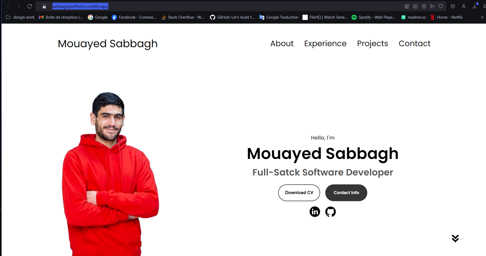

# My Portfolio Website 🌟

Welcome to my portfolio website! This project showcases my skills, projects, and experiences in web development. Built using **HTML**, **CSS**, and **JavaScript**, it represents my dedication to creating professional and user-friendly web applications.

---

## 📋 Features

- **Responsive Design**: Optimized for all devices, including desktop, tablet, and mobile.
- **Interactive Elements**: Smooth animations and interactive components for an engaging user experience.
- **Projects Showcase**: A dedicated section to display my completed projects.
- **Contact Form**: A functional contact form to reach out to me directly.

---

## 🚀 Live Demo

Check out the live version of my portfolio here:  
[My Portfolio Website](https://sabbaghportfolioo.netlify.app)
---

## 🛠️ Technologies Used

- **HTML**: For creating the structure of the website.
- **CSS**: For styling and designing a visually appealing interface.
- **JavaScript**: For adding interactivity and animations.

